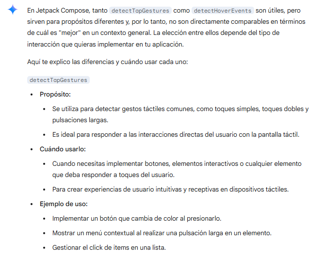
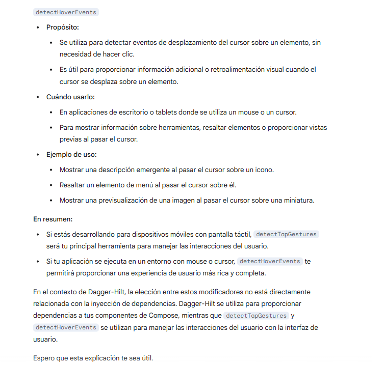
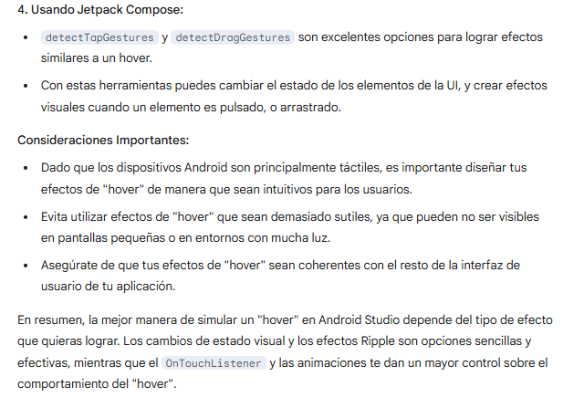
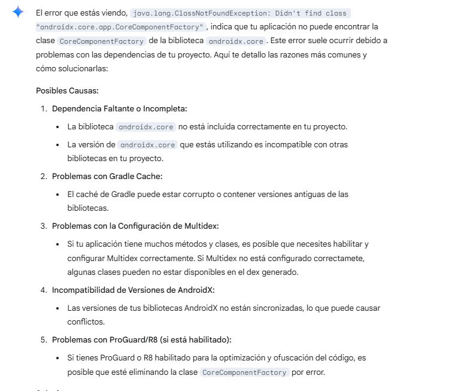
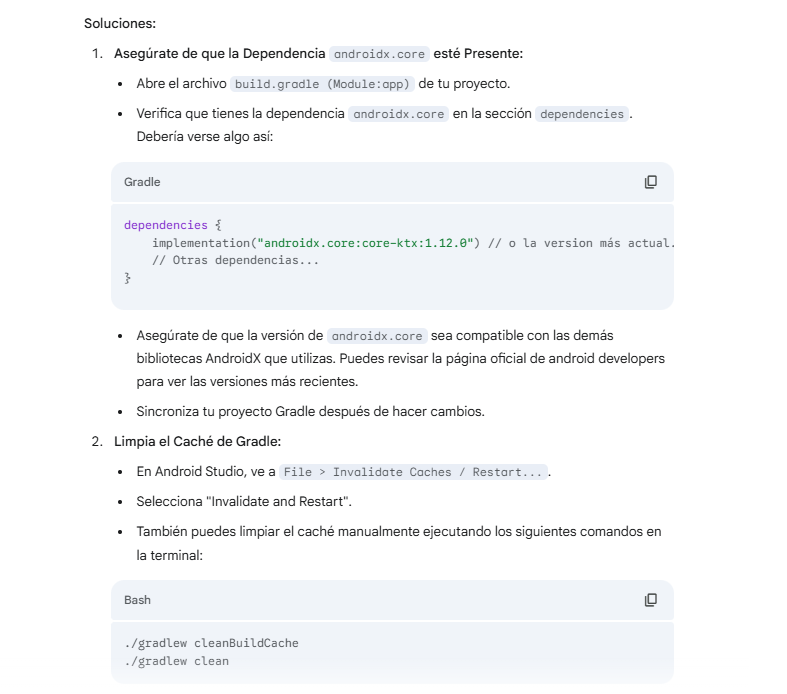
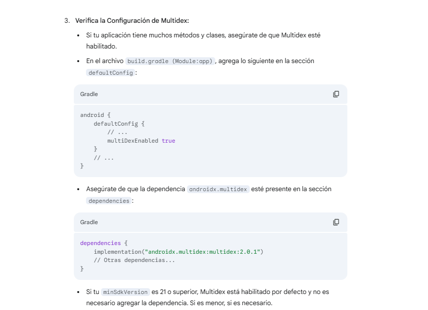
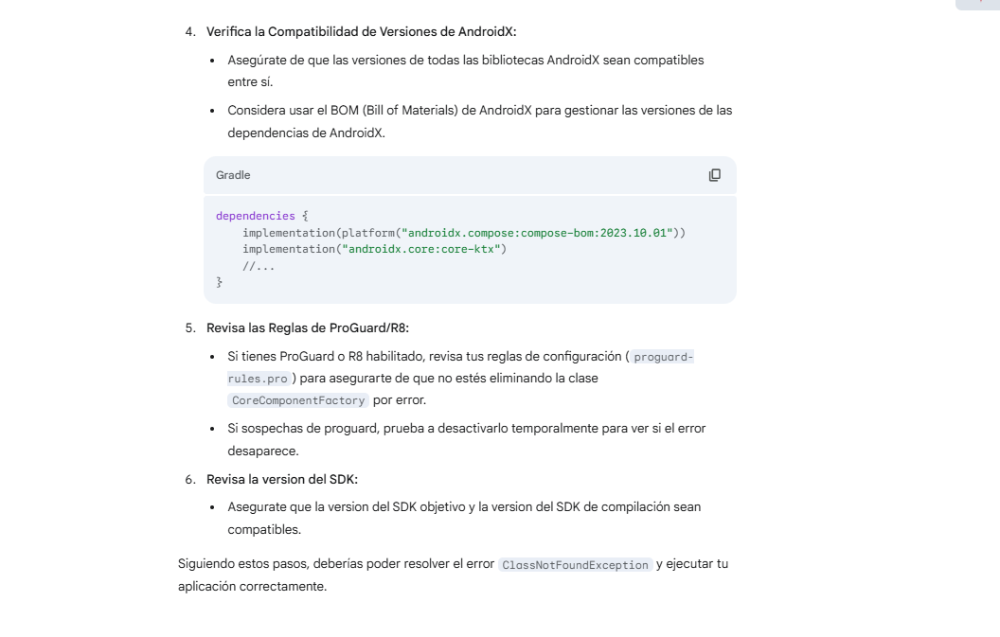
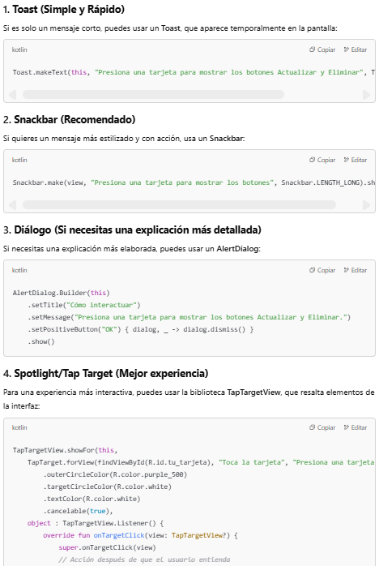
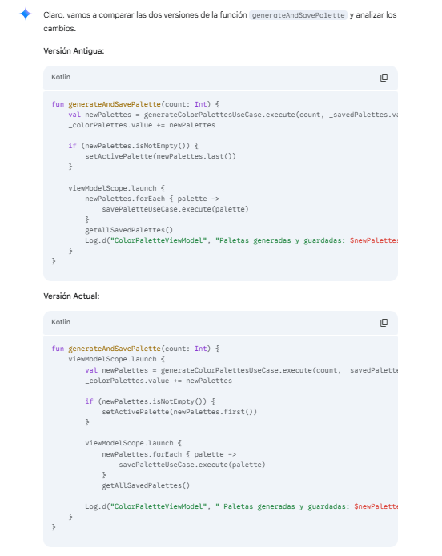

1 - Durante la creación del proyecto, tuvimos dificultades para idear cómo reproducir un efecto hover en Android Studio. Por ello, esta fue una de las preguntas que hicimos a Gemini.
 
 
 
 
2 - Encontramos algunos errores que aparecieron en Logcat, lo que también generó dudas que fueron consultadas en el chat de la IA.
 
 
 
 

3 - Otra cuestión importante durante el desarrollo del proyecto fue cómo alertar al usuario sobre la existencia de botones ocultos dentro de cada paleta y que estos elementos eran interactivos. Nuevamente, consultamos a la inteligencia artificial para saber cómo implementar esta interacción. A través de los commits, se puede notar que intenté utilizar dos de las opciones sugeridas, pero solo una funcionó correctamente.
 

4 - También realizamos comparaciones para determinar qué versión del proyecto funcionaba mejor.
 

En resumen, nuestras principales dudas fueron sobre la implementación del hover, la depuración de errores en Logcat, la señalización de botones ocultos y la elección de la mejor versión del proyecto. La inteligencia artificial fue beneficiosa para resolver estas cuestiones, proporcionando sugerencias y alternativas que ayudaron en el desarrollo.
