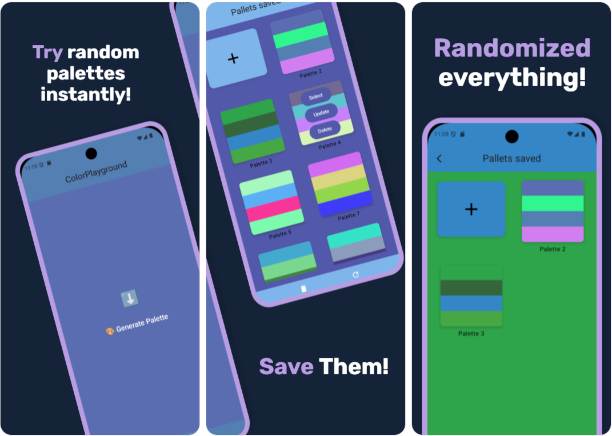

# [ColorPlayground](https://github.com/0spol/colorplayground) · [](https://github.com/0spol/colorplayground/blob/main/LICENSE)

An Android app built with Jetpack Compose for creating and testing color palettes in real-time.
It allows developers and designers to experiment with different color schemes and apply them to UI components instantly.

# Screenshots


## Features
- Create custom color palettes with HEX/RGB values.
- Test colors on various Jetpack Compose components like buttons, text, and backgrounds.
- Toggle between light and dark themes to preview designs.
- Save and export palettes in HEX or RGB format.

### Setup
1. Clone the repository:
   ```bash
   git clone https://github.com/0spol/ColorPlayground.git
   ```
2. Open the project in Android Studio.
3. Sync Gradle and build the project.
4. Run the app on an emulator or physical device.

# Contributing
Read our [contributing guide](./CONTRIBUTING.md) to learn about our development process, how to propose bugfixes and improvements, and how to build and test your changes.

## Code of Conduct
This repository has adopted a Code of Conduct that we expect project participants to adhere to. Please read [the full text](./CODE_OF_CONDUCT.md) so that you can understand what actions will and will not be tolerated.

# License
This project is licensed under the [Apache 2.0](./LICENSE.md).